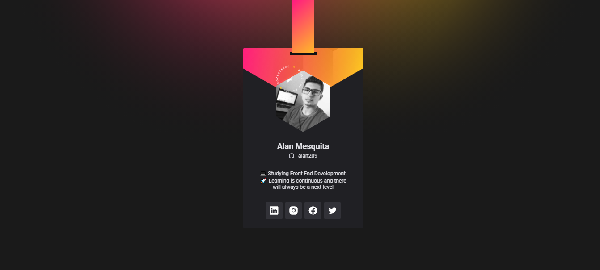
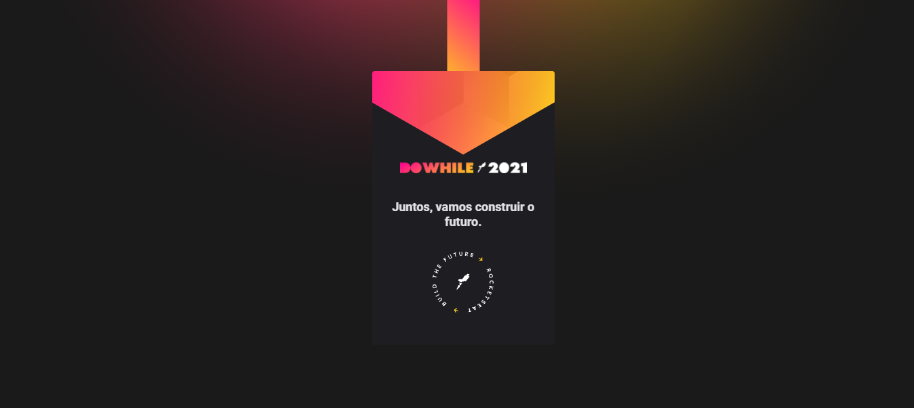
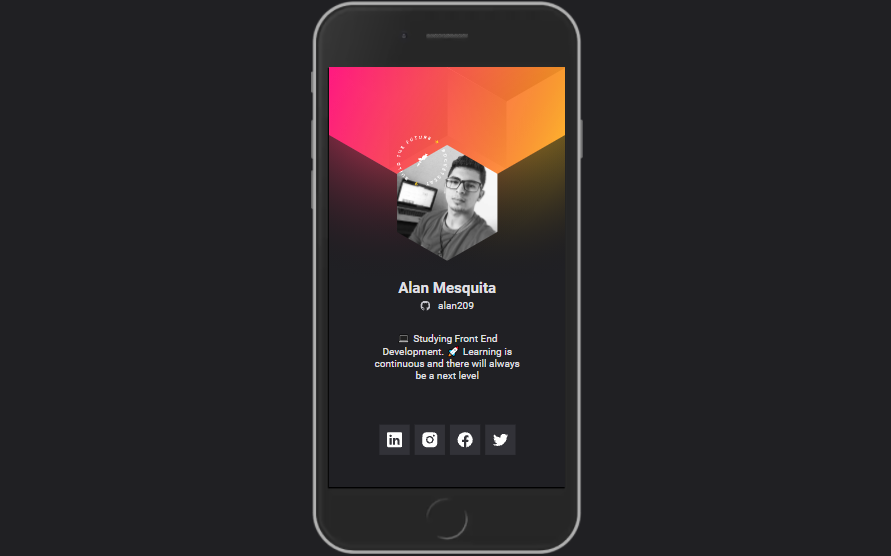

  <h1 align="center"><strong>&lt;nlw/&gt; Heat - heating for the</strong> 
  </h1>

  <a href="#-about">About</a>&nbsp;&nbsp;&nbsp;|&nbsp;&nbsp;&nbsp;
  <a href="#-technologies">Technologies</a>&nbsp;&nbsp;&nbsp;|&nbsp;&nbsp;&nbsp;
  <a href="#-layout">Layout</a>&nbsp;&nbsp;&nbsp;|&nbsp;&nbsp;&nbsp;

    
    

---

## Desktop version:

 
    
    
 

---

## Mobile Version:

 

    

---

<h2 id="about"> 💻 About: </h2>

This project was created by <a href="https://www.rocketseat.com.br/" target="_blank">Rocketseat</a> and featured at NLW Heat, Rocketseat's latest NLW of this year. The project presented in this repository was created on the Origin track, the idea of ​​this mission was to develop a card with GitHub profile information through the GitHub API.

 

---

<h3 id="technologies"> 🚀 Technologies: </h3>

This project was developed with the following technologies:

- HTML
- CSS
- JavaScript

---

<h3 id="layout"> 🔖 Layout </h3>
The project layout is in Figma, here at this <a href="https://www.figma.com/community/file/1031698737363668691/%5BNLW-Heat---Mission%3A-Origin%5D-DoWhile2021">link</a>